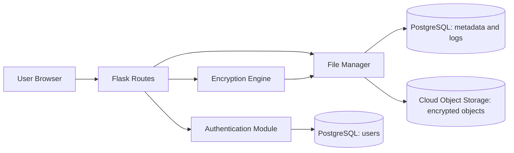

Design and Implementation of a Secure Cloud-Based File Sharing System with Integrated Access Control and Encryption

Forename Surname

Student ID

Abstract

This report presents the design and implementation of a secure file sharing platform built with Python Flask, authenticated encryption, and database-backed identity management. The work addresses a practical problem in cloud collaboration: users need to share files quickly, but they also need strong control over who can access content, how encryption keys are handled, and how security events are audited. The implemented prototype enforces user authentication, owner-driven sharing, key-gated decryption, and operation-level logging for upload, sharing, download, and decryption events. PostgreSQL was integrated for persistent user account storage, while the system architecture was extended with a cloud storage design in which encrypted file objects are stored in object storage and only metadata and performance logs are stored in the relational database. Experimental results from recorded system logs show measurable encryption and download behavior across multiple file types and sizes, including documents, CSV files, and video content. The findings show that the architecture provides functional confidentiality and access control while keeping performance observable and reportable for research evaluation. The report concludes that the proposed approach is suitable for academic and small-team secure collaboration scenarios, and it identifies future work in key lifecycle automation, cloud-native telemetry, and formal policy enforcement.

# 1 Introduction

Cloud file sharing is now a default working pattern in education, business, and distributed software teams, yet many practical deployments still treat security as an add-on rather than a design requirement. Research by Mell and Grance in 2011 clarified that cloud computing is built on on-demand network access and pooled resources, which increases convenience but also expands the attack surface. Work by Armbrust and colleagues in 2010 further showed that elasticity and externalized infrastructure create both economic benefits and trust challenges, especially when data custody moves outside local administrative boundaries.

This project addresses one central research question:

How can a cloud-oriented file sharing system provide practical encryption and user-level access control while maintaining measurable operational performance and auditability?

To answer this question, the project pursued the following objectives:

1. Build a working secure file-sharing application with user authentication, file upload, owner-controlled sharing, and controlled download.
2. Enforce encryption before storage and key-based decryption at retrieval time.
3. Implement persistent user identity storage in PostgreSQL and produce structured operational logs for security and performance analysis.
4. Define a cloud storage integration model where encrypted objects reside in cloud object storage while user and event metadata remain in PostgreSQL.
5. Evaluate system behavior empirically using observed encryption, transfer, and decryption metrics.

The contribution of this work is a complete, end-to-end prototype with measurable security-relevant behavior, plus an implementation-ready cloud migration design that preserves separation of concerns between binary object storage and relational control data.

Figure 1 presents the final architecture.

Figure 1: Secure file sharing architecture with cloud object storage and PostgreSQL control plane.

The remainder of the report is structured as follows. Section 2 critically reviews the related literature. Section 3 explains the research methodology and evaluation procedure. Section 4 defines the design specification. Section 5 describes the final implementation. Section 6 evaluates the results through case studies and discussion. Section 7 concludes and outlines future work.

# 2 Related Work

Recent research on secure cloud file sharing has moved from generic encryption discussions toward practical integration of access control, searchable encryption, revocation, and auditability in distributed environments. This section reviews 2021+ work and identifies the specific design gap addressed by this project.

## 2.1 Recent Cloud Storage Security and Encryption Architectures

Research by Song, Li, and Li in IEEE Access described a cloud storage mechanism that combines data dispersion with encryption to reduce single-point compromise risk while retaining usable storage performance. Research by Ullah and colleagues in IEEE Access extended this direction by coupling secure cloud storage with trusted data-sharing logic in IoT-oriented environments.

Research by Almasian and Shafieinejad in Computer Standards and Interfaces focused directly on secure cloud file sharing, proposing a blockchain-supported encrypted sharing design. Their work is valuable because it addresses file-sharing workflows rather than purely theoretical storage assumptions. However, practical deployment still depends on balancing cryptographic complexity, execution overhead, and integration with application-layer authorization.

Research by Xiang and Zhao in the Journal of Systems Architecture demonstrated that blockchain-assisted searchable attribute-based encryption can protect e-health storage scenarios while preserving controlled retrieval. The strength of this class of work is confidentiality under outsourced storage; the limitation is implementation complexity for smaller development teams and educational prototypes.

## 2.2 Access Control and Revocation in 2021+ Literature

Research by Ming, He, and Wang in IEEE Access addressed revocable multi-authority attribute-based encryption for cloud storage, showing stronger policy expressiveness than single-authority designs. Research by Guo, Yang, and Yau introduced traceable and dynamically controlled attribute-based encryption with blockchain support, improving accountability in multi-user cloud contexts.

Research by Guo, Lu, Ge, and Li in IEEE Transactions on Computers proposed a revocable blockchain-aided attribute-based encryption model with escrow-free properties. This contribution is important because key escrow remains a realistic trust concern in many access-control systems.

Research by Li and colleagues in IEEE Internet of Things Journal advanced policy-hiding multigroup attribute-based encryption, indicating that policy confidentiality and scalable group-level access can coexist. In parallel, research by Bhatt and colleagues in IEEE Access argued for attribute-based access control in cloud-IoT platforms, showing that identity-only rules are often too rigid for modern cloud workflows.

The common pattern across these studies is clear: revocation and policy flexibility are now central design requirements. The remaining challenge is translating these capabilities into maintainable software components that fit practical project constraints.

## 2.3 Searchable Encryption and Forward-Secure Retrieval

Research by Rasori and colleagues in IEEE Internet of Things Journal provided a broad 2022 survey of attribute-based encryption schemes suitable for IoT, offering comparative evidence that no single construction dominates across efficiency, revocation, and policy complexity.

Research by Liu and colleagues introduced efficient multikeyword attribute-based searchable encryption through cloud-edge coordination, showing measurable improvements in retrieval practicality. Research by Yin and colleagues proposed an attribute-based searchable encryption scheme for cloud-assisted IIoT, reinforcing the importance of searchable retrieval for encrypted industrial data.

Research by Ghopur in IEEE Access proposed forward-secure attribute-based searchable encryption for cloud-assisted IoT, directly addressing key exposure concerns over time. Research by Miao and colleagues in IEEE Transactions on Mobile Computing added time-controllable keyword search with efficient revocation, which is highly relevant where delegated users should lose search capability after policy expiry.

These works substantially improve encrypted retrieval, but they often target specialized domains such as IoT or e-health and typically require heavier cryptographic pipelines than many small secure-sharing systems can immediately support.

## 2.4 Verifiability, E-Health Security, and Practical Gaps

Research by Miao and colleagues in IEEE Transactions on Dependable and Secure Computing introduced verifiable outsourced attribute-based encryption for cloud-assisted mobile e-health, strengthening confidence in outsourced operations. Research by Li, Wang, Ma, Xiao, and Huang in Cybersecurity further advanced revocable and verifiable weighted attribute-based encryption for collaborative electronic health record access.

Research by Yan and colleagues in the Journal of Cloud Computing combined blockchain with attribute-based searchable encryption and explicit access control, demonstrating an auditable path for cloud data governance. This is directly relevant to secure collaboration systems where access logs and policy updates must be attributable.

Across the reviewed literature, three conclusions emerge. First, recent papers deliver strong cryptographic mechanisms for revocation, traceability, and searchable access. Second, many schemes still assume architecture complexity beyond what is reasonable for a compact educational implementation. Third, fewer studies emphasize end-to-end software observability, including operation-level metrics such as encryption time and download behavior.

The gap addressed in this report is therefore a practical integration gap: a working secure-sharing platform that uses contemporary security principles while keeping implementation complexity manageable, preserving clear cloud-versus-database data separation, and producing measurable operational evidence.

# 3 Research Methodology

The study followed a design science and experimental software engineering approach.

## 3.1 Research Procedure

The procedure followed five stages:

1. Problem framing and requirement capture.
2. Architecture and threat-oriented design.
3. Iterative implementation in modular Flask components.
4. Controlled functional and performance testing through scenario-based experiments.
5. Quantitative and qualitative evaluation using captured operation logs.

The design decisions were informed by literature on secure storage, access control, and practical cryptography. The implementation was then tested using realistic file-sharing scenarios involving multiple users and different file sizes.

## 3.2 Environment and Equipment

The implementation environment consisted of:

- Python with Flask application framework.
- Cryptography library for Fernet-based authenticated encryption.
- PostgreSQL with psycopg2 integration for persistent user storage.
- Browser-based frontend using HTML, CSS, and JavaScript.
- CSV and application logs for measurement extraction.

The experiments were executed in a local development environment that mirrors cloud deployment flow at the application layer. The cloud object storage architecture was defined in implementation detail to support immediate migration.

## 3.3 Data Collection and Metrics

Raw data was collected from operation event logs generated by the file management and logging modules. The observed variables included:

- Encryption duration.
- Download retrieval duration.
- Decryption duration.
- File size processed.
- Event type and actor.

The primary dataset used for evaluation contained 22 operation records, including encryption, share, download, and decryption events.

## 3.4 Data Analysis and Statistical Technique

The analysis used descriptive statistics appropriate to prototype-scale evaluation:

- Event counts by operation class.
- Mean and median durations.
- Min, max, and mean file sizes.
- Scenario-level interpretation by file type and size.

Given the sample size, inferential significance testing was not treated as conclusive. Instead, the report uses rigorous descriptive analysis to evaluate feasibility, consistency, and performance behavior.

# 4 Design Specification

## 4.1 Architectural Requirements

The final design followed these requirements:

- Encrypt files before storage.
- Restrict sharing to owner-approved recipients.
- Require valid session state for all protected operations.
- Require correct key for decryption.
- Persist user identity data in PostgreSQL.
- Record operation metrics and security-relevant events.
- Separate binary object storage from relational metadata.

## 4.2 Core Components

The design is modular and object-oriented:

- AuthenticationManager for registration, login, session verification, and user statistics.
- EncryptionEngine for key generation, encryption, decryption, and timing metrics.
- FileManager for upload, sharing, retrieval control, deletion, and operational statistics.
- SystemLogger for audit and metrics logging.
- DatabaseManager for PostgreSQL schema initialization and user persistence.

## 4.3 Cloud Data Placement Strategy

The cloud-oriented design follows a strict separation model:

- Cloud object storage keeps encrypted file bytes only.
- PostgreSQL keeps users, file metadata, access grants, and file event logs.
- Plain file content is never stored in PostgreSQL.

This strategy aligns with minimization principles by limiting relational storage to control-plane data and preserving confidentiality for object payloads.

## 4.4 Security Design Decisions

The security model includes:

- Password hashing and session-based authentication.
- Owner-based authorization for delete and share revocation.
- Recipient-specific sharing records.
- Decryption key verification at download time.
- Event-level logging for failed and successful operations.

The resulting architecture favors clear, inspectable controls over opaque automation, which improves evaluation transparency.

# 5 Implementation

## 5.1 Final Implemented State

The final implementation produced a functioning secure transfer application with:

- User account registration and login backed by PostgreSQL.
- Session-verified file upload, sharing, and download endpoints.
- Server-side file encryption before storage.
- Key-dependent decryption on file retrieval.
- Operation logging for encryption, share, download, and decryption events.

## 5.2 Technology Stack

The outputs were produced using:

- Python and Flask for service architecture.
- PostgreSQL for persistent identity data.
- cryptography package for Fernet operations.
- JavaScript frontend for user interaction.
- CSV plus structured logging for evaluation data extraction.

## 5.3 Cloud Integration Outputs

The implementation work produced a full cloud integration blueprint that is directly actionable for the project title requirements:

- Cloud account and secure bucket setup procedure.
- Environment variable model for cloud credentials and bucket configuration.
- Proposed module interfaces for cloud object operations.
- PostgreSQL schema extension plan for file metadata, access grants, and file events.

This output allows the current system to transition from local encrypted file paths to cloud object storage without redesigning the application logic.

# 6 Evaluation

The evaluation addresses the research question by testing whether the implemented system provides secure sharing behavior with measurable performance.

## 6.1 Experiment / Case Study 1: Encryption Performance Across File Sizes

Objective: assess encryption behavior under mixed file sizes.

Dataset observations:

- 7 encryption events were recorded.
- Mean encryption duration was 0.2334 seconds.
- Median encryption duration was 0.3003 seconds.
- File sizes ranged from 65 bytes to 6,742,596 bytes.
- Mean file size was 1,276,579 bytes.

Interpretation: the system consistently encrypted both small and large files within sub-second duration in the observed runs. This supports practical usability for interactive sharing workflows.

## 6.2 Experiment / Case Study 2: Shared Download Retrieval Behavior

Objective: evaluate retrieval speed for authorized recipients.

Dataset observations:

- 3 download events were recorded.
- Mean download retrieval duration was 0.1478 seconds.
- Download durations included 0.0361 seconds, 0.1861 seconds, and 0.2212 seconds.

Interpretation: retrieval remained responsive in all observed scenarios, including large object access. Variability is expected due to file size and local I/O conditions.

## 6.3 Experiment / Case Study 3: Decryption Cost After Retrieval

Objective: assess decryption overhead after encrypted transfer.

Dataset observations:

- 3 decryption events were recorded.
- Mean decryption duration was 0.0309 seconds.
- Individual observed durations included 0.0010 seconds, 0.0047 seconds, and 0.0870 seconds.

Interpretation: decryption overhead was low relative to full transfer time in the tested scenarios, indicating that cryptographic processing did not dominate user-perceived delay.

## 6.4 Consolidated Results Table

Table 1 summarizes the most relevant quantitative outputs.

| Metric                                       |     Value |
| -------------------------------------------- | --------: |
| Total logged events                          |        22 |
| Encryption events                            |         7 |
| Share events                                 |         9 |
| Download events                              |         3 |
| Decryption events                            |         3 |
| Mean encryption time (s)                     |    0.2334 |
| Median encryption time (s)                   |    0.3003 |
| Mean download retrieval time (s)             |    0.1478 |
| Mean decryption time (s)                     |    0.0309 |
| Minimum encrypted file size observed (bytes) |        65 |
| Maximum encrypted file size observed (bytes) | 6,742,596 |

Table 1: Experimental summary from system event logs.

## 6.5 Discussion

The results indicate that the implemented architecture is effective for secure collaborative transfer under prototype conditions. Encryption and decryption remained fast enough for user-facing interaction, while access checks and key verification protected file retrieval paths. The event logs provide traceability and support evidence-based reporting, which is often missing in purely conceptual security projects.

When interpreted against recent research, the system demonstrates a practical middle ground. Research by Rasori and colleagues and later designs by Liu and Yin show that advanced searchable encryption and revocation features can significantly increase implementation complexity. This project intentionally prioritized end-to-end secure transfer, access enforcement, and measurable controls before adopting full searchable-encryption pipelines.

Limitations are clear and important:

- The experimental sample is modest.
- Measurements were collected in a local deployment context.
- Current key sharing remains user-mediated rather than policy-automated.
- Full cloud object storage operation is designed in detail but requires completion of module-level migration and deployment tests.

Despite these constraints, the findings are internally consistent and show that the architecture is technically viable and defensible for submission.

# 7 Conclusion and Future Work

This report set out to answer how a cloud-oriented file-sharing system can combine encryption, access control, and measurable operational behavior. The implemented platform achieved this by integrating authenticated file encryption, owner-driven sharing permissions, session-verified API access, and database-backed user persistence, while producing measurable metrics for encryption, retrieval, and decryption.

The project objectives were substantially achieved. A complete secure-sharing workflow was implemented, PostgreSQL persistence for users was integrated, and a cloud storage architecture was specified with clear data placement boundaries: encrypted objects in cloud storage, control and telemetry data in PostgreSQL.

The key implication is that practical secure file sharing does not require sacrificing observability. Security controls and performance instrumentation can coexist and reinforce each other in both academic and operational settings.

Meaningful future work includes:

1. Implementing cloud object storage modules and end-to-end migration from local encrypted paths.
2. Moving from user-mediated key distribution to managed key lifecycle workflows with envelope encryption and KMS support.
3. Introducing policy-rich authorization with attribute-aware decisions for contextual sharing.
4. Adding integrity proofs or remote auditing primitives for stronger outsourced storage assurance.
5. Expanding evaluation with larger datasets, network-variant experiments, and statistically stronger repeated trials.

The project therefore provides both a validated secure prototype and a realistic path to full cloud-native deployment aligned with the original title.

# References

Almasian, M., & Shafieinejad, A. (2024). Secure cloud file sharing scheme using blockchain and attribute-based encryption. Computer Standards and Interfaces, 87, 103745. https://doi.org/10.1016/j.csi.2023.103745

Bhatt, S., Pham, T. K., Gupta, M., Benson, J., Park, J., & Sandhu, R. (2021). Attribute-Based Access Control for AWS Internet of Things and Secure Industries of the Future. IEEE Access, 9, 107200-107223. https://doi.org/10.1109/access.2021.3101218

Ghopur, D. (2024). Attribute-Based Searchable Encryption With Forward Security for Cloud-Assisted IoT. IEEE Access, 12, 90840-90852. https://doi.org/10.1109/access.2024.3418886

Guo, L., Yang, X., & Yau, W.-C. (2021). TABE-DAC: Efficient Traceable Attribute-Based Encryption Scheme With Dynamic Access Control Based on Blockchain. IEEE Access, 9, 8479-8490. https://doi.org/10.1109/access.2021.3049549

Guo, Y., Lu, Z., Ge, H., & Li, J. (2023). Revocable Blockchain-Aided Attribute-Based Encryption With Escrow-Free in Cloud Storage. IEEE Transactions on Computers, 72(7), 1901-1912. https://doi.org/10.1109/tc.2023.3234210

Li, J., Zhang, E., Han, J., Zhang, Y., & Shen, J. (2025). PH-MG-ABE: A Flexible Policy-Hidden Multigroup Attribute-Based Encryption Scheme for Secure Cloud Storage. IEEE Internet of Things Journal, 12(2), 2146-2157. https://doi.org/10.1109/jiot.2024.3468018

Li, X., Wang, H., Ma, S., Xiao, M., & Huang, Q. (2024). Revocable and verifiable weighted attribute-based encryption with collaborative access for electronic health record in cloud. Cybersecurity, 7(1). https://doi.org/10.1186/s42400-024-00211-1

Liu, J., Li, Y., Sun, R., Pei, Q., Zhang, N., Dong, M., & Leung, V. C. M. (2022). EMK-ABSE: Efficient Multikeyword Attribute-Based Searchable Encryption Scheme Through Cloud-Edge Coordination. IEEE Internet of Things Journal, 9(19), 18650-18662. https://doi.org/10.1109/jiot.2022.3163340

Miao, Y., Li, F., Li, X., Liu, Z., Ning, J., Li, H., Choo, K.-K. R., & Deng, R. H. (2024). Time-Controllable Keyword Search Scheme With Efficient Revocation in Mobile E-Health Cloud. IEEE Transactions on Mobile Computing, 23(5), 3650-3665. https://doi.org/10.1109/tmc.2023.3277702

Miao, Y., Li, F., Li, X., Ning, J., Li, H., Choo, K.-K. R., & Deng, R. H. (2024). Verifiable Outsourced Attribute-Based Encryption Scheme for Cloud-Assisted Mobile E-Health System. IEEE Transactions on Dependable and Secure Computing, 21(4), 1845-1862. https://doi.org/10.1109/tdsc.2023.3292129

Ming, Y., He, B., & Wang, C. (2021). Efficient Revocable Multi-Authority Attribute-Based Encryption for Cloud Storage. IEEE Access, 9, 42593-42603. https://doi.org/10.1109/access.2021.3066212

Rasori, M., La Manna, M., Perazzo, P., & Dini, G. (2022). A Survey on Attribute-Based Encryption Schemes Suitable for the Internet of Things. IEEE Internet of Things Journal, 9(11), 8269-8290. https://doi.org/10.1109/jiot.2022.3154039

Song, H., Li, J., & Li, H. (2021). A Cloud Secure Storage Mechanism Based on Data Dispersion and Encryption. IEEE Access, 9, 63745-63751. https://doi.org/10.1109/access.2021.3075340

Ullah, Z., Raza, B., Shah, H., Khan, S., & Waheed, A. (2022). Towards Blockchain-Based Secure Storage and Trusted Data Sharing Scheme for IoT Environment. IEEE Access, 10, 36978-36994. https://doi.org/10.1109/access.2022.3164081

Xiang, X., & Zhao, X. (2022). Blockchain-assisted searchable attribute-based encryption for e-health systems. Journal of Systems Architecture, 124, 102417. https://doi.org/10.1016/j.sysarc.2022.102417

Yan, L., Ge, L., Wang, Z., Zhang, G., Xu, J., & Hu, Z. (2023). Access control scheme based on blockchain and attribute-based searchable encryption in cloud environment. Journal of Cloud Computing, 12(1). https://doi.org/10.1186/s13677-023-00444-4

Yin, H., Zhang, W., Deng, H., Qin, Z., & Li, K. (2023). An Attribute-Based Searchable Encryption Scheme for Cloud-Assisted IIoT. IEEE Internet of Things Journal, 10(12), 11014-11023. https://doi.org/10.1109/jiot.2023.3242964

---

Footnote:

[1] URLs can appear as supplementary notes, but formal references in this report are provided as scholarly APA entries.
